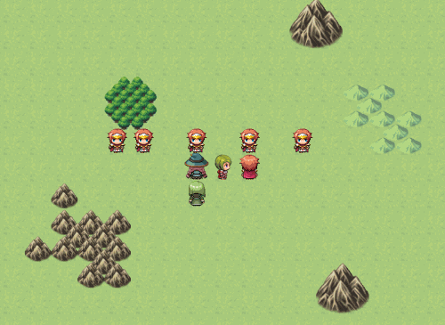
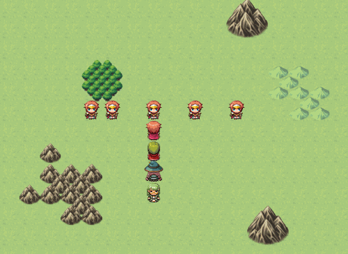
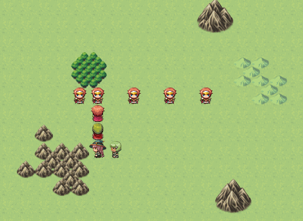

Transitions Plugin for RPG Maker MV
===================================

This JavaScript plugin for [RPG Maker MV](http://www.rpgmakerweb.com/products/programs/rpg-maker-mv) replaces the default fading behaviour with a transition system.

Transitions can be configured independently, by using plugin commands, for:
- scene to scene transitions,
- in-Event fades,
- player's transfers,
- battles.

Other than the basic transition (which imitates the default fading), the following transitions are implemented:

- Cut: the screen is cut in two slices, sliding side by side

- Melt: the screen melts down

- Iris: the screen opens like a camera's iris

Instructions
------------

Download the [latest release](releases/latest) (alternatively compile your own using the Makefile) and load the plugin.

At any time invoke the plugin with `SetTransfer mode transition`, with `mode` one of:
- `battle`: transition before each encounter,
- `transfer`: transition on player transfer,
- `fade`: transition invoked from events,
- `base`: transition between scenes;

...and `transition` one of:
- `base`,
- `cut`,
- `iris`,
- `melt`.

For example, to change the battle transition to `melt` you can call:

    SetTransition battle melt

A demo can be downloaded in the release section, or played online [here](https://strontiumaluminate.altervista.org/transitions/).

Adding new transitions
----------------------

You can add new transitions by extending the `Transition_Base` class (see the [documentation](https://HashakGik.github/Transitions-RMMV) and adding the line:

    my.transitions['class'] = "my.Transition_class";

where the hash key is the string used in the plugin calls and the value is the class name.

**Important**: the class name must start with `Transition_`, in order to be correctly parsed.

Finally, you can recompile the entire script or load your transition as a separate plugin.